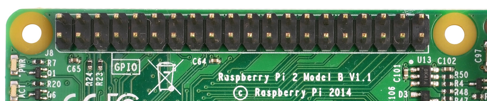

## 1.1: Introducing RPi OS, or bare-metal "Hello, World!"

We are going to start our journey in OS development by writing a small, bare-metal "Hello, World" application. I assume that  you have gone through the [Prerequisites](../Prerequisites.md) and have everything ready. If not, now is the time to do this.

Before we move forward, I want to establish a simple naming convention. From the README file you can see that the whole tutorial is divided into lessons. Each lesson consists of individual files that I call "chapters" (right now, you are reading lesson 1, chapter 1.1). A chapter is further divided into "sections" with headings. This naming convention allows me to make references to different parts of the material.

Another thing I want you to pay attention to is that the tutorial contains a lot of source code samples. I'll usually start the explanation by providing the complete code block, and then describe it line by line. 

### Project structure

The source code of each lesson has the same structure. You can find this lesson's source code [here](https://github.com/s-matyukevich/raspberry-pi-os/tree/master/src/lesson01). Let's briefly describe the main components of this folder:
1. **Makefile** We will use the [make](http://www.math.tau.ac.il/~danha/courses/software1/make-intro.html) utility to build the kernel. `make`'s behavior is configured by a Makefile, which contains instructions on how to compile and link the source code. 
1. **build.sh or build.bat** You'll need these files if you want to build the kernel using Docker. You won't need to have the make utility or the compiler toolchain installed on your laptop.
1. **src** This folder contains all of the source code.
1. **include** All of the header files are placed here. 

### Makefile

Now let's take a closer look at the project Makefile. The primary purpose of the make utility is to automatically determine what pieces of a program need to be recompiled, and to issue commands to recompile them. If you are not familiar with make and Makefiles, I recommend that you read [this](http://opensourceforu.com/2012/06/gnu-make-in-detail-for-beginners/) article. 
The Makefile used in the first lesson can be found [here](https://github.com/s-matyukevich/raspberry-pi-os/blob/master/src/lesson01/Makefile). The whole Makefile is listed below:
```
ARMGNU ?= aarch64-linux-gnu

COPS = -Wall -nostdlib -nostartfiles -ffreestanding -Iinclude -mgeneral-regs-only
ASMOPS = -Iinclude 

BUILD_DIR = build
SRC_DIR = src

all : kernel8.img

clean :
    rm -rf $(BUILD_DIR) *.img 

$(BUILD_DIR)/%_c.o: $(SRC_DIR)/%.c
    mkdir -p $(@D)
    $(ARMGNU)-gcc $(COPS) -MMD -c $< -o $@

$(BUILD_DIR)/%_s.o: $(SRC_DIR)/%.S
    $(ARMGNU)-gcc $(ASMOPS) -MMD -c $< -o $@

C_FILES = $(wildcard $(SRC_DIR)/*.c)
ASM_FILES = $(wildcard $(SRC_DIR)/*.S)
OBJ_FILES = $(C_FILES:$(SRC_DIR)/%.c=$(BUILD_DIR)/%_c.o)
OBJ_FILES += $(ASM_FILES:$(SRC_DIR)/%.S=$(BUILD_DIR)/%_s.o)

DEP_FILES = $(OBJ_FILES:%.o=%.d)
-include $(DEP_FILES)

kernel8.img: $(SRC_DIR)/linker.ld $(OBJ_FILES)
    $(ARMGNU)-ld -T $(SRC_DIR)/linker.ld -o $(BUILD_DIR)/kernel8.elf  $(OBJ_FILES)
    $(ARMGNU)-objcopy $(BUILD_DIR)/kernel8.elf -O binary kernel8.img
``` 
Now, let's inspect this file in detail:
```
ARMGNU ?= aarch64-linux-gnu
```
The Makefile starts with a variable definition. `ARMGNU` is a cross-compiler prefix. We need to use a [cross-compiler](https://en.wikipedia.org/wiki/Cross_compiler) because we are compiling the source code for the `arm64` architecture on an `x86` machine. So instead of `gcc`, we will use `aarch64-linux-gnu-gcc`. 

```
COPS = -Wall -nostdlib -nostartfiles -ffreestanding -Iinclude -mgeneral-regs-only
ASMOPS = -Iinclude 
```

`COPS` and `ASMOPS` are options that we pass to the compiler when compiling C and assembler code, respectively. These options require a short explanation:

* **-Wall** Show all warnings.
* **-nostdlib** Don't use the C standard library. Most of the calls in the C standard library eventually interact with the operating system. We are writing a bare-metal program, and we don't have any underlying operating system, so the C standard library is not going to work for us anyway.
* **-nostartfiles** Don't use standard startup files. Startup files are responsible for setting an initial stack pointer, initializing static data, and jumping to the main entry point. We are going to do all of this by ourselves.
* **-ffreestanding** A freestanding environment is an environment in which the standard library may not exist, and program startup may not necessarily be at main. The option `-ffreestanding` directs the compiler to not assume that standard functions have their usual definition.
* **-Iinclude** Search for header files in the `include` folder.
* **-mgeneral-regs-only**. Use only general-purpose registers. ARM processors also have [NEON](https://developer.arm.com/technologies/neon) registers. We don't want the compiler to use them because they add additional complexity (since, for example, we will need to store the registers during a context switch).

```
BUILD_DIR = build
SRC_DIR = src
```

`SRC_DIR` and `BUILD_DIR` are directories that contain source code and compiled object files, respectively.

```
all : kernel8.img

clean :
    rm -rf $(BUILD_DIR) *.img 
```

Next, we define make targets. The first two targets are pretty simple: the `all` target is the default one, and it is executed whenever you type `make` without any arguments (`make` always uses the first target as the default). This target just redirects all work to a different target, `kernel8.img`. 
The `clean` target is responsible for deleting all compilation artifacts and the compiled kernel image.

```
$(BUILD_DIR)/%_c.o: $(SRC_DIR)/%.c
    mkdir -p $(@D)
    $(ARMGNU)-gcc $(COPS) -MMD -c $< -o $@

$(BUILD_DIR)/%_s.o: $(SRC_DIR)/%.S
    $(ARMGNU)-gcc $(ASMOPS) -MMD -c $< -o $@
```

The next two targets are responsible for compiling C and assembler files. If, for example, in the `src` directory we have `foo.c` and `foo.S` files, they will be compiled into `build/foo_c.o` and `build/foo_s.o`, respectively. `$<` and `$@` are substituted at runtime with the input and output filenames (`foo.c` and `foo_c.o`). Before compiling C files, we also create a `build` directory in case it doesn't exist yet.

```
C_FILES = $(wildcard $(SRC_DIR)/*.c)
ASM_FILES = $(wildcard $(SRC_DIR)/*.S)
OBJ_FILES = $(C_FILES:$(SRC_DIR)/%.c=$(BUILD_DIR)/%_c.o)
OBJ_FILES += $(ASM_FILES:$(SRC_DIR)/%.S=$(BUILD_DIR)/%_s.o)
```

Here we are building an array of all object files (`OBJ_FILES`) created from the concatenation of both C and assembler source files.

```
DEP_FILES = $(OBJ_FILES:%.o=%.d)
-include $(DEP_FILES)
```

The next two lines are a little bit tricky. If you take a look at how we defined our compilation targets for both C and assembler source files, you will notice that we used the `-MMD` parameter. This parameter instructs the `gcc` compiler to create a dependency file for each generated object file. A dependency file defines all of the dependencies for a particular source file. These dependencies usually contain a list of all included headers. We need to include all of the generated dependency files so that make knows what exactly to recompile in case a header changes. 

```
$(ARMGNU)-ld -T $(SRC_DIR)/linker.ld -o kernel8.elf  $(OBJ_FILES)
``` 

We use the `OBJ_FILES` array to build the `kernel8.elf` file. We use the linker script `src/linker.ld` to define the basic layout of the resulting executable image (we will discuss the linker script in the next section).

```
$(ARMGNU)-objcopy kernel8.elf -O binary kernel8.img
```

`kernel8.elf` is in the [ELF](https://en.wikipedia.org/wiki/Executable_and_Linkable_Format) format. The problem is that ELF files are designed to be executed by an operating system. To write a bare-metal program, we need to extract all executable and data sections from the ELF file and put them into the `kernel8.img` image. The trailing `8` denotes ARMv8 which is a 64-bit architecture. This filename tells the firmware to boot the processor into 64-bit mode.
You can also boot the CPU in the 64-bit mode by using `arm_control=0x200` flag in the `config.txt` file. The RPi OS previously used this method, and you can still find it in some of the exercise answers. However, `arm_control` flag is undocumented and it is preferable to use `kernel8.img` naming convention instead.

### The linker script

The primary purpose of the linker script is to describe how the sections in the input object files (`_c.o` and `_s.o`) should be mapped into the output file (`.elf`). More information about linker scripts can be found [here](https://sourceware.org/binutils/docs/ld/Scripts.html#Scripts). Now let's take a look at the RPi OS linker script:

```
SECTIONS
{
    .text.boot : { *(.text.boot) }
    .text :  { *(.text) }
    .rodata : { *(.rodata) }
    .data : { *(.data) }
    . = ALIGN(0x8);
    bss_begin = .;
    .bss : { *(.bss*) } 
    bss_end = .;
}
``` 

After startup, the Raspberry Pi loads `kernel8.img` into memory and starts execution from the beginning of the file. That's why the `.text.boot` section must be first; we are going to put the OS startup code inside this section. 
The `.text`, `.rodata`, and `.data` sections contain kernel-compiled instructions, read-only data, and normal data––there is nothing special to add about them.
The `.bss` section contains data that should be initialized to 0. By putting such data in a separate section, the compiler can save some space in the ELF binary––only the section size is stored in the ELF header, but the section itself is omitted. After loading the image into memory, we must initialize the `.bss` section to 0; that's why we need to record the start and end of the section (hence the `bss_begin` and `bss_end` symbols) and align the section so that it starts at an address that is a multiple of 8. If the section is not aligned, it would be more difficult to use the `str` instruction to store 0 at the beginning of the `bss` section because the `str` instruction can be used only with 8-byte-aligned addresses.

### Booting the kernel

Now it is time to take a look at the [boot.S](https://github.com/s-matyukevich/raspberry-pi-os/blob/master/src/lesson01/src/boot.S) file. This file contains the kernel startup code:

```
#include "mm.h"

.section ".text.boot"

.globl _start
_start:
    mrs    x0, mpidr_el1        
    and    x0, x0,#0xFF        // Check processor id
    cbz    x0, master        // Hang for all non-primary CPU
    b    proc_hang

proc_hang: 
    b proc_hang

master:
    adr    x0, bss_begin
    adr    x1, bss_end
    sub    x1, x1, x0
    bl     memzero

    mov    sp, #LOW_MEMORY
    bl    kernel_main
```
Let's review this file in detail:
```
.section ".text.boot"
```
First, we specify that everything defined in `boot.S` should go in the `.text.boot` section. Previously, we saw that this section is placed at the beginning of the kernel image by the linker script. So when the kernel is started, execution begins at the `start` function:
```
.globl _start
_start:
    mrs    x0, mpidr_el1        
    and    x0, x0,#0xFF        // Check processor id
    cbz    x0, master        // Hang for all non-primary CPU
    b    proc_hang
```

The first thing this function does is check the processor ID. The Raspberry Pi 3 has four core processors, and after the device is powered on, each core begins to execute the same code. However, we don't want to work with four cores; we want to work only with the first one and put all of the other cores in an endless loop. This is exactly what the `_start` function is responsible for. It gets the processor ID from the [mpidr_el1](http://infocenter.arm.com/help/index.jsp?topic=/com.arm.doc.ddi0500g/BABHBJCI.html) system register. 
If the current process ID is 0, then execution is transferred to the `master` function:

```
master:
    adr    x0, bss_begin
    adr    x1, bss_end
    sub    x1, x1, x0
    bl     memzero
```

Here, we clean the `.bss` section by calling `memzero`. We will define this function later. In ARMv8 architecture, by convention, the first seven arguments are passed to the called function via registers x0–x6. The `memzero` function accepts only two arguments: the start address (`bss_begin`) and the size of the section needed to be cleaned (`bss_end - bss_begin`).

```
    mov    sp, #LOW_MEMORY
    bl    kernel_main
```

After cleaning the `.bss` section, we initialize the stack pointer and pass execution to the `kernel_main` function. The Raspberry Pi loads the kernel at address 0; that's why the initial stack pointer can be set to any location high enough so that stack will not override the kernel image when it grows sufficiently large. `LOW_MEMORY` is defined in [mm.h](https://github.com/s-matyukevich/raspberry-pi-os/blob/master/src/lesson01/include/mm.h) and is equal to 4MB. Our kernel's stack won't grow very large and the image itself is tiny, so `4MB` is more than enough for us. 

For those of you who are not familiar with ARM assembler syntax, let me quickly summarize the instructions that we have used:

* [**mrs**](http://www.keil.com/support/man/docs/armasm/armasm_dom1361289881374.htm) Load value from a system register to one of the general purpose registers (x0–x30)
* [**and**](http://www.keil.com/support/man/docs/armasm/armasm_dom1361289863017.htm) Perform the logical AND operation. We use this command to strip the last byte from the value we obtain from the `mpidr_el1` register.
* [**cbz**](http://www.keil.com/support/man/docs/armasm/armasm_dom1361289867296.htm) Compare the result of the previously executed operation to 0 and jump (or `branch` in ARM terminology) to the provided label if the comparison yields true.
* [**b**](http://www.keil.com/support/man/docs/armasm/armasm_dom1361289863797.htm) Perform an unconditional branch to some label.
* [**adr**](http://www.keil.com/support/man/docs/armasm/armasm_dom1361289862147.htm) Load a label's relative address into the target register. In this case, we want pointers to the start and end of the `.bss` region.
* [**sub**](http://www.keil.com/support/man/docs/armasm/armasm_dom1361289908389.htm) Subtract values from two registers.
* [**bl**](http://www.keil.com/support/man/docs/armasm/armasm_dom1361289865686.htm) "Branch with a link": perform an unconditional branch and store the return address in x30 (the link register). When the subroutine is finished, use the `ret` instruction to jump back to the return address.
* [**mov**](http://www.keil.com/support/man/docs/armasm/armasm_dom1361289878994.htm) Move a value between registers or from a constant to a register.

[Here](http://infocenter.arm.com/help/index.jsp?topic=/com.arm.doc.den0024a/index.html) is the ARMv8-A developer's guide. It's a good resource if the ARM ISA is unfamiliar to you. [This page](http://infocenter.arm.com/help/index.jsp?topic=/com.arm.doc.den0024a/ch09s01s01.html) specifically outlines the register usage convention in the ABI.

### The `kernel_main` function

We have seen that the boot code eventually passes control to the `kernel_main` function. Let's take a look at it:

```
#include "mini_uart.h"

void kernel_main(void)
{
    uart_init();
    uart_send_string("Hello, world!\r\n");

    while (1) {
        uart_send(uart_recv());
    }
}

```

This function is one of the simplest in the kernel. It works with the `Mini UART` device to print to screen and read user input. The kernel just prints `Hello, world!` and then enters an infinite loop that reads characters from the user and sends them back to the screen.

### Raspberry Pi devices 

Now we are going to dig into something specific to the Raspberry Pi. Before we begin, I recommend that you download the [BCM2837 ARM Peripherals manual](https://github.com/raspberrypi/documentation/files/1888662/BCM2837-ARM-Peripherals.-.Revised.-.V2-1.pdf). BCM2837 is a board that is used by the Raspberry Pi 3 Models B, and B+. Sometime in our discussion, I will also mention BCM2835 and BCM2836 - those are names of the boars used in older versions of the Raspberry Pi.  

Before we proceed to the implementation details, I want to share some basic concepts on how to work with memory-mapped devices. BCM2837 is a simple [SOC (System on a chip)](https://en.wikipedia.org/wiki/System_on_a_chip) board. In such a board, access to all devices is performed via memory-mapped registers. The Raspberry Pi 3 reserves the memory above address `0x3F000000` for devices. To activate or configure a particular device, you need to write some data in one of the device's registers. A device register is just a 32-bit region of memory. The meaning of each bit in each device register is described in the `BCM2837 ARM Peripherals` manual. Take a look at section 1.2.3 ARM physical addresses in the manual and the surrounding documentation for more context on why we use `0x3F000000` as a base address (even though `0x7E000000` is used throughout the manual).

From the `kernel_main` function, you can guess that we are going to work with a Mini UART device. UART stands for [Universal asynchronous receiver-transmitter](https://en.wikipedia.org/wiki/Universal_asynchronous_receiver-transmitter). This device is capable of converting values stored in one of its memory mapped registers to a sequence of high and low voltages. This sequence is passed to your computer via the `TTL-to-serial cable` and is interpreted by your terminal emulator. We are going to use the Mini UART to facilitate communication with our Raspberry Pi. If you want to see the specification of the Mini UART registers, please go to page 8 of the `BCM2837 ARM Peripherals` manual. 

A Raspberry Pi has two UARTs: Mini UART and PL011 UART. In this tutorial, we are going to work only with the first one, because it is simpler. There is, however, an optional [exercise](https://github.com/s-matyukevich/raspberry-pi-os/blob/master/docs/lesson01/exercises.md) that shows how to work with PL011 UART. You can refer to the [official documentation](https://www.raspberrypi.org/documentation/configuration/uart.md) if you want to find out more about Raspberry Pi UARTs and learn the difference between them.

Another device that you need to familiarize yourself with is the GPIO [General-purpose input/output](https://en.wikipedia.org/wiki/General-purpose_input/output). GPIOs are responsible for controlling `GPIO pins`. You should be able to easily recognize them in the image below:



The GPIO can be used to configure the behavior of different GPIO pins. For example, to be able to use the Mini UART, we need to activate pins 14 and 15 and set them up to use this device. The image below illustrates how numbers are assigned to the GPIO pins:


### Mini UART initialization

Now let's take a look at how mini UART is initialized. This code is defined in [mini_uart.c](https://github.com/s-matyukevich/raspberry-pi-os/blob/master/src/lesson01/src/mini_uart.c):

```
void uart_init ( void )
{
    unsigned int selector;

    selector = get32(GPFSEL1);
    selector &= ~(7<<12);                   // clean gpio14
    selector |= 2<<12;                      // set alt5 for gpio14
    selector &= ~(7<<15);                   // clean gpio15
    selector |= 2<<15;                      // set alt5 for gpio 15
    put32(GPFSEL1,selector);

    put32(GPPUD,0);
    delay(150);
    put32(GPPUDCLK0,(1<<14)|(1<<15));
    delay(150);
    put32(GPPUDCLK0,0);

    put32(AUX_ENABLES,1);                   //Enable mini uart (this also enables access to it registers)
    put32(AUX_MU_CNTL_REG,0);               //Disable auto flow control and disable receiver and transmitter (for now)
    put32(AUX_MU_IER_REG,0);                //Disable receive and transmit interrupts
    put32(AUX_MU_LCR_REG,3);                //Enable 8 bit mode
    put32(AUX_MU_MCR_REG,0);                //Set RTS line to be always high
    put32(AUX_MU_BAUD_REG,270);             //Set baud rate to 115200

    put32(AUX_MU_CNTL_REG,3);               //Finally, enable transmitter and receiver
}
``` 

Here, we use the two functions `put32` and `get32`. Those functions are very simple; they allow us to read and write some data to and from a 32-bit register. You can take a look at how they are implemented in [utils.S](https://github.com/s-matyukevich/raspberry-pi-os/blob/master/src/lesson01/src/utils.S). `uart_init` is one of the most complex and important functions in this lesson, and we will continue to examine it in the next three sections.

#### GPIO alternative function selection 

First, we need to activate the GPIO pins. Most of the pins can be used with different devices, so before using a particular pin, we need to select the pin's `alternative function`. An `alternative function` is just a number from 0 to 5 that can be set for each pin and configures which device is connected to the pin. You can see the list of all available GPIO alternative functions in the image below (the image is taken from page 102 of `BCM2837 ARM Peripherals` manual):


Here you can see that pins 14 and 15 have the TXD1 and RXD1 alternative functions available. This means that if we select alternative function number 5 for pins 14 and 15, they will be used as a Mini UART Transmit Data pin and Mini UART Receive Data pin, respectively. The `GPFSEL1` register is used to control alternative functions for pins 10-19. The meaning of all the bits in those registers is shown in the following table (page 92 of `BCM2837 ARM Peripherals` manual):


So now you know everything you need to understand the following lines of code that are used to configure GPIO pins 14 and 15 to work with the Mini UART device:

```
    unsigned int selector;

    selector = get32(GPFSEL1);
    selector &= ~(7<<12);                   // clean gpio14
    selector |= 2<<12;                      // set alt5 for gpio14
    selector &= ~(7<<15);                   // clean gpio15
    selector |= 2<<15;                      // set alt5 for gpio 15
    put32(GPFSEL1,selector);
```

#### GPIO pull-up/down 

When you work with Raspberry Pi GPIO pins, you will often encounter terms such as pull-up/pull-down. These concepts are explained in great detail in [this](https://grantwinney.com/using-pullup-and-pulldown-resistors-on-the-raspberry-pi/) article. For those who are too lazy to read the whole article, I will briefly explain the pull-up/pull-down concept.

If you use a particular pin as input and don't connect anything to this pin, you will not be able to identify whether the value of the pin is 1 or 0. In fact, the device will report random values. The pull-up/pull-down mechanism allows you to overcome this issue. If you set the pin to the pull-up state and nothing is connected to it, it will report `1` all the time (for the pull-down state, the value will always be 0). In our case, we need neither the pull-up nor the pull-down state, because both the 14 and 15 pins are going to be connected all the time. The pin state is preserved even after a reboot, so before using any pin, we always have to initialize its state. There are three available states: pull-up, pull-down, and neither (to remove the current pull-up or pull-down state), and we need the third one.

Switching between pin states is not a very simple procedure because it requires physically toggling a switch on the electric circuit. This process involves the `GPPUD` and `GPPUDCLK` registers and is described on page 101 of the `BCM2837 ARM Peripherals` manual. I copied the description here:

```
The GPIO Pull-up/down Clock Registers control the actuation of internal pull-downs on
the respective GPIO pins. These registers must be used in conjunction with the GPPUD
register to effect GPIO Pull-up/down changes. The following sequence of events is
required:
1. Write to GPPUD to set the required control signal (i.e. Pull-up or Pull-Down or neither
to remove the current Pull-up/down)
2. Wait 150 cycles – this provides the required set-up time for the control signal
3. Write to GPPUDCLK0/1 to clock the control signal into the GPIO pads you wish to
modify – NOTE only the pads which receive a clock will be modified, all others will
retain their previous state.
4. Wait 150 cycles – this provides the required hold time for the control signal
5. Write to GPPUD to remove the control signal
6. Write to GPPUDCLK0/1 to remove the clock
``` 

This procedure describes how we can remove both the pull-up and pull-down states from a pin, which is what we are doing for pins 14 and 15 in the following code:

```
    put32(GPPUD,0);
    delay(150);
    put32(GPPUDCLK0,(1<<14)|(1<<15));
    delay(150);
    put32(GPPUDCLK0,0);
```

#### Initializing the Mini UART

Now our Mini UART is connected to the GPIO pins, and the pins are configured. The rest of the `uart_init` function is dedicated to Mini UART initialization. 

```
    put32(AUX_ENABLES,1);                   //Enable mini uart (this also enables access to its registers)
    put32(AUX_MU_CNTL_REG,0);               //Disable auto flow control and disable receiver and transmitter (for now)
    put32(AUX_MU_IER_REG,0);                //Disable receive and transmit interrupts
    put32(AUX_MU_LCR_REG,3);                //Enable 8 bit mode
    put32(AUX_MU_MCR_REG,0);                //Set RTS line to be always high
    put32(AUX_MU_BAUD_REG,270);             //Set baud rate to 115200
    put32(AUX_MU_IIR_REG,6);                //Clear FIFO

    put32(AUX_MU_CNTL_REG,3);               //Finally, enable transmitter and receiver
```
Let's examine this code snippet line by line. 

```
    put32(AUX_ENABLES,1);                   //Enable mini uart (this also enables access to its registers)
```
This line enables the Mini UART. We must do this in the beginning, because this also enables access to all the other Mini UART registers.

```
    put32(AUX_MU_CNTL_REG,0);               //Disable auto flow control and disable receiver and transmitter (for now)
```
Here we disable the receiver and transmitter before the configuration is finished. We also permanently disable auto-flow control because it requires us to use additional GPIO pins, and the TTL-to-serial cable doesn't support it. For more information about auto-flow control, you can refer to [this](http://www.deater.net/weave/vmwprod/hardware/pi-rts/) article.

```
    put32(AUX_MU_IER_REG,0);                //Disable receive and transmit interrupts
```
It is possible to configure the Mini UART to generate a processor interrupt each time new data is available. We are going to start working with interrupts in lesson 3, so for now, we will just disable this feature.

```
    put32(AUX_MU_LCR_REG,3);                //Enable 8 bit mode
```
Mini UART can support either 7- or 8-bit operations. This is because an ASCII character is 7 bits for the standard set and 8 bits for the extended. We are going to use 8-bit mode. 

```
    put32(AUX_MU_MCR_REG,0);                //Set RTS line to be always high
```
The RTS line is used in the flow control and we don't need it. Set it to be high all the time.
```
    put32(AUX_MU_BAUD_REG,270);             //Set baud rate to 115200
```
The baud rate is the rate at which information is transferred in a communication channel. “115200 baud” means that the serial port is capable of transferring a maximum of 115200 bits per second. The baud rate of your Raspberry Pi mini UART device should be the same as the baud rate in your terminal emulator. 
The Mini UART calculates baud rate according to the following equation:
```
baudrate = system_clock_freq / (8 * ( baudrate_reg + 1 )) 
```
The `system_clock_freq` is 250 MHz, so we can easily calculate the value of `baudrate_reg` as 270.

``` 
    put32(AUX_MU_CNTL_REG,3);               //Finally, enable transmitter and receiver
```
After this line is executed, the Mini UART is ready for work!

### Sending data using the Mini UART

After the Mini UART is ready, we can try to use it to send and receive some data. To do this, we can use the following two functions:

```
void uart_send ( char c )
{
    while(1) {
        if(get32(AUX_MU_LSR_REG)&0x20) 
            break;
    }
    put32(AUX_MU_IO_REG,c);
}

char uart_recv ( void )
{
    while(1) {
        if(get32(AUX_MU_LSR_REG)&0x01) 
            break;
    }
    return(get32(AUX_MU_IO_REG)&0xFF);
}
```

Both of the functions start with an infinite loop, the purpose of which is to verify whether the device is ready to transmit or receive data. We are using  the `AUX_MU_LSR_REG` register to do this. Bit zero, if set to 1, indicates that the data is ready; this means that we can read from the UART. Bit five, if set to 1, tells us that the transmitter is empty, meaning that we can write to the UART.
Next, we use `AUX_MU_IO_REG` to either store the value of the transmitted character or read the value of the received character.

We also have a very simple function that is capable of sending strings instead of characters:

```
void uart_send_string(char* str)
{
    for (int i = 0; str[i] != '\0'; i ++) {
        uart_send((char)str[i]);
    }
}
```
This function just iterates over all characters in a string and sends them one by one. 

### Raspberry Pi config

The Raspberry Pi startup sequence is the following (simplified):

1. The device is powered on.
1. The GPU starts up and reads the `config.txt` file from the boot partition. This file contains some configuration parameters that the GPU uses to further adjust the startup sequence.
1. `kernel8.img` is loaded into memory and executed.

To be able to run our simple OS, the `config.txt` file should be the following:

```
kernel_old=1
disable_commandline_tags=1
```
* `kernel_old=1` specifies that the kernel image should be loaded at address 0.
* `disable_commandline_tags` instructs the GPU to not pass any command line arguments to the booted image.


### Testing the kernel

Now that we have gone through all of the source code, it is time to see it work. To build and test the kernel you need to  do the following:

1. Execute `./build.sh` or `./build.bat` from [src/lesson01](https://github.com/s-matyukevich/raspberry-pi-os/tree/master/src/lesson01) in order to build the kernel. 
1. Copy the generated `kernel8.img` file to the `boot` partition of your Raspberry Pi flash card and delete `kernel7.img`. Make sure you left all other files in the boot partition untouched (see [this](https://github.com/s-matyukevich/raspberry-pi-os/issues/43) issue for details)
1. Modify the `config.txt` file as described in the previous section.
1. Connect the USB-to-TTL serial cable as described in the [Prerequisites](../Prerequisites.md).
1. Power on your Raspberry Pi.
1. Open your terminal emulator. You should be able to see the `Hello, world!` message there.

Note that the sequence of steps described above asumes that you have Raspbian installed on your SD card. It is also posible to run the RPi OS using an empty SD card.

1. Prepare your SD card:
    * Use an MBR partition table
    * Format the boot partition as FAT32
    > The card should be formatted exactly in the same way as it is required to install Raspbian. Check `HOW TO FORMAT AN SD CARD AS FAT` section in the [official documenation](https://www.raspberrypi.org/documentation/installation/noobs.md) for more information.
1. Copy the following files to the card:
    * [bootcode.bin](https://github.com/raspberrypi/firmware/blob/master/boot/bootcode.bin) This is the GPU bootloader, it contains the GPU code to start the GPU and load the GPU firmware. 
    * [start.elf](https://github.com/raspberrypi/firmware/blob/master/boot/start.elf) This is the GPU firmware. It reads `config.txt` and enables the GPU to load and run ARM specific user code from `kernel8.img`
1. Copy `kernel8.img` and `config.txt` files. 
1. Connect the USB-to-TTL serial cable.
1. Power on your Raspberry Pi.
1. Use your terminal emulator to connect to the RPi OS. 

Unfortunately, all Raspberry Pi firmware files are closed-sourced and undocumented. For more information about the Raspberry Pi startup sequence, you can refer to some unofficial sources, like [this](https://raspberrypi.stackexchange.com/questions/10442/what-is-the-boot-sequence) StackExchange question or [this](https://github.com/DieterReuter/workshop-raspberrypi-64bit-os/blob/master/part1-bootloader.md) Github repository.

##### Previous Page

[Prerequisites](../../docs/Prerequisites.md)

##### Next Page

1.2 [Kernel Initialization: Linux project structure](../../docs/lesson01/linux/project-structure.md)
